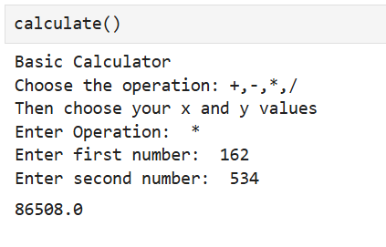

# Python Calculator

**Author:** Jorge Flores  
**Project Type:** Learning / Portfolio Project  

## About This Project
This is a simple calculator built in Python using a Jupyter Notebook.  
It performs basic arithmetic operations like addition, subtraction, multiplication, and division.  

The goal of this project was to practice Python fundamentals, work with Jupyter Notebook, and get hands-on experience creating something functional that I could showcase in my portfolio.

## How to Use
1. Open `calculator.ipynb` in Jupyter Notebook.
2. Run the cells by pressing **Shift + Enter**.
3. You can modify the numbers or add your own calculations to experiment.

## Example Output
Here’s a screenshot of the calculator in action:

## Skills Demonstrated
- Python basics: functions, operators, and printing output  
- Using Jupyter Notebook for interactive coding  
- Organizing a project and version control with Git/GitHub  

## Next Steps / Improvements
- Add support for more complex operations like exponentiation or square roots  
- Implement a simple graphical interface using `tkinter`  
- Expand the notebook with explanations and examples for each operation

---

This project is beginner-friendly but a great starting point to show **hands-on Python experience**.
